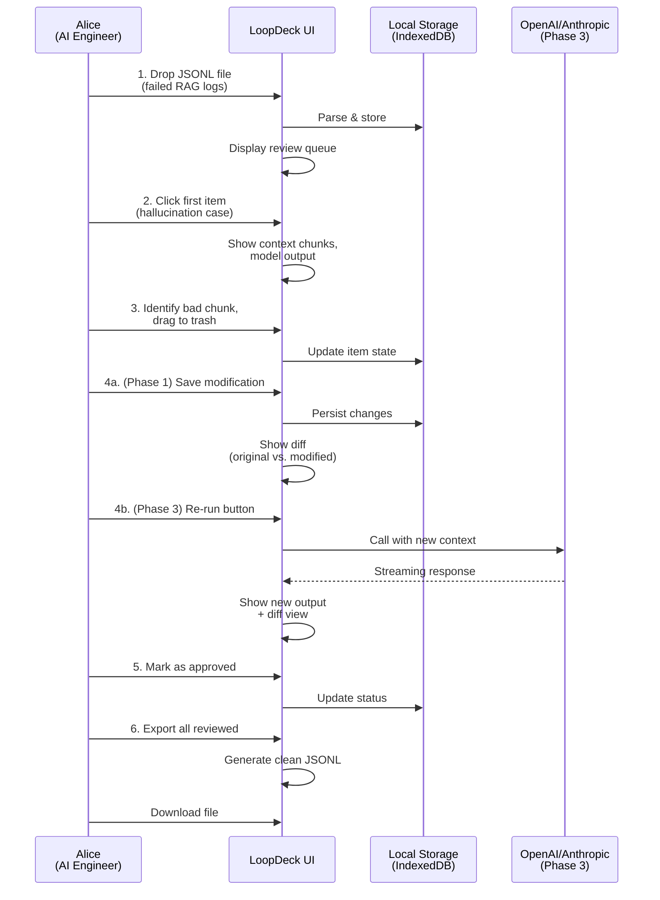
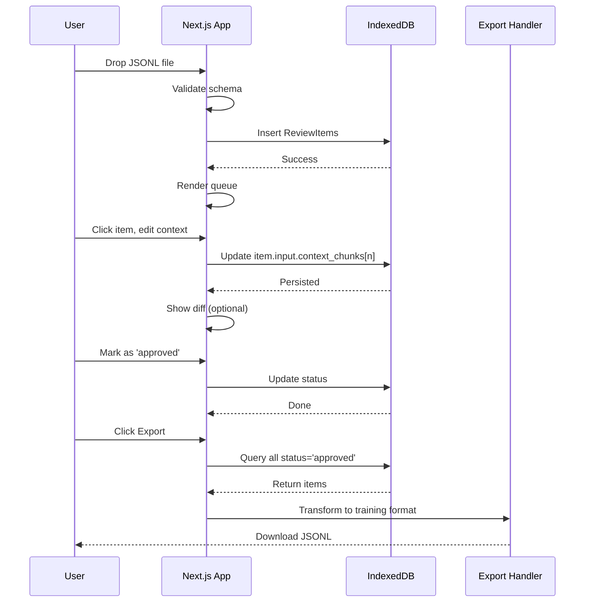

# Product Requirement Document: LoopDeck

| Metadata | Details |
|----------|----------|
| Product Name | LoopDeck |
| Version | 0.2 (MVP Draft) |
| Status | Concept / Development-Ready |
| Author | [Team] |
| Last Updated | January 11, 2026 |
| Target Release | Q2 2026 (Phase 1) |
| Core Stack | Next.js 15 (App Router), Shadcn UI, dnd-kit, Tailwind CSS, TypeScript, Biome.js, Dexie.js (IndexedDB), Vitest, Playwright |
| License | MIT (Target) |

## 1. Executive Summary

LoopDeck is an open-source UI component library and workflow management tool designed specifically for reviewing, debugging, and curating Large Language Model (LLM) outputs.

Unlike generic chat interfaces, LoopDeck treats the AI generation process as a malleable object. It empowers human reviewers to inspect Retrieval Augmented Generation (RAG) context, re-rank model outputs for RLHF (Reinforcement Learning from Human Feedback), and correct structured data (JSON) or multimodal outputs before they enter a production dataset.

**Target Market**: AI engineers, data curators, and domain experts building fine-tuning datasets and debugging RAG systems. Initial focus: teams processing 100–10,000 review items per project.

## 2. Success Metrics

Product success will be measured by the following KPIs:

| Metric | Target | Notes |
|--------|--------|-------|
| Review Throughput | 50+ items/hour | Single reviewer, average item complexity |
| Time-to-Approve | <2 minutes per item | Including any context modifications |
| Error Reduction | 30% fewer hallucinations detected | Post-reranking vs. baseline |
| Data Export Volume | 100% of reviewed items exportable | JSONL format, preserving all metadata |
| User Adoption | 50+ active users by end of Q2 | GitHub stars, npm downloads |
| Keyboard Navigation Adoption | 70% of power users | Hotkeys (1,2,3) for voting, Tab for navigation |

## 3. Constraints & Assumptions

**Technical Constraints:**
- Maximum JSONL file size: 50 MB (browser memory limit)
- Supported browsers: Chrome, Firefox, Safari (latest 2 versions)
- Target device: Desktop/Laptop (tablet support Phase 2+)
- Single-user MVP: No team collaboration, authentication, or multi-user sync in Phase 1
- Internet optional: Application must work offline; cloud sync is Phase 3+ scope

**Assumptions:**
- Users have basic familiarity with JSON and JSONL formats
- Retrieval context is pre-computed (LoopDeck does not run retrieval)
- API keys (OpenAI, Anthropic) are user-provided for re-run feature (Phase 3)
- Review items fit the defined `ReviewItem` schema or are automatically normalized

## 4. Non-Functional Requirements

| Requirement | Target | Rationale |
|-------------|--------|----------|
| **Performance** | Initial load <2s, scrolling 60fps | Professional tool, high-density UI |
| **Virtualization** | Handle 100k+ items efficiently | Via `@tanstack/react-virtual` |
| **Accessibility** | WCAG 2.1 Level AA | Inclusive design for domain experts |
| **Bundle Size** | Components <100 KB gzipped | Fast installation for monorepos |
| **Component Reusability** | Copy-pasteable from docs | Follow Shadcn UI paradigm |
| **Test Coverage** | Unit tests 80%+, E2E for critical paths | Vitest + Playwright |
| **Dark Mode** | Supported out-of-box | Shadcn UI + Tailwind CSS |
| **Mobile Responsiveness** | Progressive enhancement | Desktop first (Phase 1), mobile Phase 2+ |

## 5. Problem Statement

## 5. Problem Statement

The Black Box of RAG: When an AI hallucinates, engineers often cannot easily see or manipulate the retrieved context chunks that caused the error.

Spreadsheet Fatigue: Most fine-tuning datasets are cleaned in Excel or Google Sheets, which is error-prone and lacks rich visualization for code or markdown.

Lack of Fit-for-Purpose Tooling: Existing solutions fall short—
- **Argilla** and **Label Studio** are general-purpose annotation platforms designed for image labeling and classification, not RAG debugging
- **Lilac** focuses on dataset exploration and clustering, not interactive output ranking and context re-sequencing
- Enterprise platforms (Arize, LangSmith) are expensive and closed-source

LoopDeck fills this gap by providing a lightweight, open-source component purpose-built for the RAG + fine-tuning workflow. Its core innovation is **drag-to-rerank context**, allowing engineers to test hypotheses about retrieval quality in real-time without code.

## 6. User Personas

### Primary Persona: Alice (The AI Engineer)

| Attribute | Details |
|-----------|---------|
| **Goals** | Debug why models hallucinate; improve retrieval quality; create golden datasets for fine-tuning |
| **Frustrations** | Can't see context chunks; uses `console.log()` for inspection; spreadsheets don't show markdown/code properly; slow iteration cycle |
| **Technical Proficiency** | High (Python, JSON, APIs) |
| **Tools Used** | VSCode, Jupyter, curl, LangChain |
| **Success Criteria** | Identify and fix 5 retrieval bugs per session; export clean JSONL in <1 hour |
| **Usage Frequency** | Daily |

### Secondary Persona: Bob (The Subject Matter Expert)

| Attribute | Details |
|-----------|---------|
| **Goals** | Verify AI outputs are accurate; approve/reject with comments; not write code |
| **Frustrations** | JSON is confusing; doesn't understand token counts; wants plain English summaries |
| **Technical Proficiency** | Low (non-technical domain expert) |
| **Tools Used** | Google Sheets, email |
| **Success Criteria** | Review 20 items without errors; one-click approve/reject |
| **Usage Frequency** | Weekly or as-needed |

### Tertiary Persona: Charlie (The Data Curator)

| Attribute | Details |
|-----------|---------|
| **Goals** | Process 1,000+ items to build curated training dataset; maximize quality, speed |
| **Frustrations** | Manual copy-paste is slow; needs bulk operations; wants to filter by quality score |
| **Technical Proficiency** | Medium (understands data pipelines) |
| **Tools Used** | Pandas, BigQuery, DVC |
| **Success Criteria** | Process 100 items/hour; export ready for training in one step |
| **Usage Frequency** | Intensive (8-hour sprints) |

**Persona Priority Order:** Alice (Primary, P0) → Charlie (Secondary, P0) → Bob (Tertiary, P1)

### Primary User Workflow: Debug Hallucination



## 7. Functional Requirements

### 7.1. Core View: The "RAG Context Sculptor"

**Goal**: Allow users to visualize and manipulate the context fed into the LLM.

| ID | Feature | Description | Priority | Acceptance Criteria |
|----|---------|-------------|----------|-------------------|
| R1.1 | Context Visualization | Display retrieved context chunks as individual cards. Show metadata (Source, Similarity Score). | P0 | **Given** a JSONL with 5+ context chunks **When** user opens an item **Then** display each chunk as a draggable card with source, score, token count; support files with 100+ chunks (virtualized) |
| R1.2 | Drag-to-Prioritize | Use dnd-kit to allow users to reorder context chunks. Top items are weighted higher. | P0 | **Given** context chunks **When** user drags a card up **Then** update order, show visual feedback, persist to IndexedDB; hotkey support (arrow keys) |
| R1.3 | Exclusion Logic | Allow users to drag a chunk to a "Trash/Ignore" zone to test generation without that specific data point. | P1 | **Given** draggable chunks **When** user drags to trash zone **Then** mark chunk as excluded, show visual strike-through, persist state |
| R1.4 | Diff View | When context is changed and generation is re-run, show a diff view of the old answer vs. the new answer. | P1 | **Given** original output + modified output **When** displayed side-by-side **Then** highlight additions (green), deletions (red) using Git-style diffing |
| R1.5 | Empty Context Handling | Gracefully handle items with 0 context chunks. | P0 | **Given** item with no context **When** rendered **Then** show informative message, allow user to still proceed |

### 7.2. Core View: The "Rank & File" Arena (RLHF)

**Goal**: Compare multiple model outputs for A/B testing or preference gathering.

| ID | Feature | Description | Priority | Acceptance Criteria |
|----|---------|-------------|----------|-------------------|
| R2.1 | Side-by-Side View | Display User Prompt at the top, with 2+ columns below showing outputs from different models (e.g., GPT-4 vs. Mistral). | P0 | **Given** a review item with 2+ model outputs **When** opened **Then** show prompt header, side-by-side columns (max 3 on desktop), syntax highlighting for code blocks |
| R2.2 | Ranking Sorting | Users can drag columns left/right to rank them (1st = Best). | P0 | **Given** model output columns **When** user drags left/right **Then** reorder, update ranking metadata, persist to IndexedDB; save to `human_feedback.ranking` |
| R2.3 | Golden Response Editor | A dedicated text area where the user can copy parts from Model A and Model B to create the perfect "Ground Truth" answer. | P1 | **Given** multiple model outputs **When** user selects text + clicks "Add to Golden" **Then** append to editor, show attribution (Model A line 3), allow free editing |
| R2.4 | Keyboard Nav | Hotkeys (1, 2, 3) to vote for the best response rapidly. | P2 | **Given** 3 model outputs **When** user presses 1, 2, or 3 **Then** mark that model as selected in `human_feedback.selected_model_id`, show visual highlight |

### 7.3. Core View: Multimodal & Structured Data

**Goal**: Specialized handling for non-text outputs.

| ID | Feature | Description | Priority | Acceptance Criteria |
|----|---------|-------------|----------|-------------------|
| R3.1 | JSON Repair Field | If the output is JSON, render it as a Shadcn Form. If the JSON is broken, provide a visual linter to fix syntax errors. | P1 | **Given** malformed JSON output **When** rendered **Then** show error location, suggest fixes (missing comma, unclosed bracket), allow inline editing |
| R3.2 | Image Inspection | If output is an image, allow click-to-zoom and display generation parameters (Seed, CFG Scale) in a hover card. | P2 | **Given** image URL in output **When** rendered **Then** show thumbnail, click-to-modal zoom, display metadata if available |

### 7.4. Data Ingestion & Export

**Goal**: Agnostic integration with existing pipelines.

| ID | Feature | Description | Priority | Acceptance Criteria |
|----|---------|-------------|----------|-------------------|
| R4.1 | JSONL Import | Native support for dropping a .jsonl file (OpenAI format) to populate the review queue. | P0 | **Given** valid JSONL file (OpenAI format) **When** dropped on UI **Then** parse, validate against schema, store in IndexedDB, show import summary (10 items loaded); handle files >50MB with error message |
| R4.2 | Export to Training | One-click export of "Reviewed" items to a clean JSONL file ready for fine-tuning. | P0 | **Given** reviewed items with status='approved' **When** user clicks Export **Then** generate JSONL, include only fields needed for fine-tuning (prompt, corrected_text), trigger download |
| R4.3 | Adapter Pattern | Interface to connect to LangSmith or LangFuse APIs for fetching traces. | P2 | **Given** API credentials **When** user configures integration **Then** fetch traces, normalize to ReviewItem schema, populate queue |
| R4.4 | Bulk Status Update | Allow users to select multiple items and change status in bulk. | P0 | **Given** filtered queue of 10+ items **When** user selects all, clicks "Mark Approved" **Then** update status for all selected items, show confirmation count |

## 8. Technical Architecture

### 8.1. Tech Stack Details

**Language**: TypeScript
- Why: Essential for type safety when handling complex, nested AI data structures and API responses.

**Framework**: Next.js 15 (App Router)
- Why: Handling streaming responses (RSC) and server actions for database writes. Server actions enable secure API key handling in Phase 3.

**Component Library**: Shadcn UI
- Why: Copy-pasteable code, accessible, themable, and uses Radix primitives. Aligns with our component reusability goal.

**Interaction Library**: dnd-kit
- Why: Best-in-class React drag-and-drop, accessible (keyboard support), small bundle size.

**State Management**: Zustand
- Why: Minimal API surface, good for local state (review queue, filters). Optional cloud sync via plugins.

**Database (Local-First)**: Dexie.js (IndexedDB wrapper)
- Why: Browser-native persistence without server dependency. Supports offline workflows. Optional `SyncAdapter` interface for Phase 3 cloud sync (Postgres, MongoDB).

**Virtual Scrolling**: `@tanstack/react-virtual`
- Why: Render 100k+ items efficiently without lag. Essential for high-density UI.

**Testing**: Vitest + Testing Library (unit/component) + Playwright (E2E)
- Why: Fast feedback loop; Playwright supports keyboard/accessibility testing. Vitest provides sub-second test runs for CI/CD.

**Linting & Formatting**: Biome.js
- Why: Fast, zero-config, opinionated formatter and linter to maintain code quality in public open-source.

### 8.2. Data Schema (Refined for Local-First)

```typescript
type ReviewItem = {
  // Core fields
  id: string;                          // UUID
  version: number;                     // Schema version (enables migrations)
  created_at: string;                  // ISO 8601 timestamp
  updated_at: string;                  // Last modified timestamp
  created_by?: string;                 // User ID (future: multi-user)

  // Status & metadata
  status: 'pending' | 'approved' | 'rejected' | 'modified';
  tags?: string[];                     // User-defined tags for filtering
  sync_status?: 'local' | 'synced' | 'conflict';  // For Phase 3 cloud sync

  // Input context
  input: {
    prompt: string;
    system_prompt?: string;            // Often needed for RAG debugging
    context_chunks: Array<{
      id: string;
      text: string;
      source: string;
      score: number;                   // Similarity score (0-1)
      embedding?: number[];            // Optional: for client-side re-ranking
      metadata?: Record<string, unknown>;  // Flexible metadata (doc_id, etc.)
      excluded?: boolean;              // Marked for exclusion
      rank?: number;                   // User's reranked position
    }>;
  };

  // Model outputs
  outputs: Array<{
    model_id: string;
    text: string;
    token_usage: number;
    latency_ms: number;
    finish_reason?: string;            // 'stop', 'max_tokens', etc.
  }>;

  // Human feedback & corrections
  human_feedback: {
    selected_model_id?: string;        // Best model (from R2.4)
    ranking?: string[];                // Model IDs in order (from R2.2)
    corrected_text?: string;           // Golden edited response (from R2.3)
    golden_context_ids?: string[];     // Which context chunks were used
    comments?: string;                 // Human review notes
  };
};

// Sync adapter interface (Phase 3)
interface SyncAdapter {
  push(items: ReviewItem[]): Promise<void>;
  pull(since: number): Promise<ReviewItem[]>;
  conflict(local: ReviewItem, remote: ReviewItem): ReviewItem;
}
```

### 8.3. System Architecture Diagram

```mermaid
digraph LR
    A["User (Browser)"] -->|1. Drop JSONL| B["Next.js App (Client)"]
    B -->|Parse & validate| C["Dexie.js<br/>(IndexedDB)"]
    B -->|Display| D["React Components<br/>(Shadcn, dnd-kit)"]
    D -->|Re-order context| C
    D -->|Edit outputs| C
    D -->|Keyboard nav| D

    B -.->|Phase 3: Re-run| E["API Keys<br/>(Secure via Server Actions)"]
    E -->|Call| F["OpenAI/Anthropic APIs"]
    F -->|Stream response| B

    B -.->|Phase 3: Cloud Sync| G["SyncAdapter<br/>(Postgres/MongoDB)"]
    C -.->|bi-directional| G

    B -->|Export| H["JSONL File<br/>(Download)"]

    style C fill:#e1f5ff
    style G fill:#fff3e0
    style A fill:#f3e5f5
    style B fill:#e8f5e9
```

### 8.4. Data Flow: JSONL → Review → Export



## 9. UI/UX Guidelines

### 9.1. Layout Philosophy: "The IDE for Prose"

**Density**: High. This is a professional tool. Use smaller fonts (13px/14px) for metadata and clear distinction between headers and body text.

**Panels**: Use `react-resizable-panels`. The user should be able to widen the "Context" panel if debugging retrieval, or the "Output" panel if proofreading.

**Dark Mode**: Supported by default using Shadcn UI + Tailwind CSS. Respect system preference (prefers-color-scheme).

### 9.2. Core View Wireframes

#### View 1: RAG Context Sculptor

```
┌──────────────────────────────────────────────────────────┐
│  LoopDeck  [Filters] [Export] [Help]                 │
├──────────────────┬──────────────────────────────────────┤
│ Queue          │ Review: Item #42                     │
│ ┌──────────────┐ │ ┌────────────────────────────────────┐ │
│ │ pending[5] │ │ │ Prompt: "What is...?"          │ │
│ │ approved[3]│ │ │ System: "You are a lawyer..."  │ │
│ │ modified[1]│ │ └────────────────────────────────────┘ │
│ │            │ │                                      │
│ │ Item #42   │ │ Context Chunks (Reorderable):       │
│ │ ┌────────┐ │ │ │ 1️⃣  [▲▼] Chunk from doc_A       │ │
│ │ │ RAG Err│ │ │     Score: 0.92 🟢                 │ │
│ │ │ ...    │ │ │     "Lorem ipsum dolor sit..."    │ │
│ │ └────────┘ │ │ ─────────────────────────────────── │
│ │            │ │ │ 2️⃣  [▲▼] Chunk from doc_B       │ │
│ │ Item #43   │ │     Score: 0.71 🟡 [Mark trash]  │ │
│ │ ┌────────┐ │ │     "Consectetur adipiscing..."  │ │
│ │ │ ...    │ │ │ ─────────────────────────────────── │
│ │ └────────┘ │ │ │ 3️⃣  [▲▼] Chunk from doc_C       │ │
│ │            │ │     Score: 0.55 🔴                 │ │
│ │ Trash:     │ │     "Sed do eiusmod tempor..."    │ │
│ │ ┌────────────┤ │ Generated Response:                 │
│ │ │ (Drag here)│ │ ┌────────────────────────────────────┐ │
│ │ └────────────┤ │ │ "Lorem ipsum is a type of..." │ │
│ │            │ │ │                              │ │
│ │            │ │ [✓ Approve] [✗ Reject] [Edit]  │
│ └──────────────┴──────────────────────────────────────┘
```

#### View 2: Rank & File Arena (RLHF)

```
┌────────────────────────────────────────────────────────────────┐
│  LoopDeck  [Filters] [Export] [Help]                       │
├──────────────────┬──────────────────────────────────────────────┤
│ Queue          │ Compare: Item #10                        │
│ ┌──────────────┐ │ ┌──────────────────────────────────────────┐ │
│ │ pending[12]│ │ │ Prompt: "Summarize this paper..."  │ │
│ │ approved[5]│ │ └──────────────────────────────────────────┘ │
│ │ modified[3]│ │                                          │
│ │            │ │ Model Outputs (Drag to rank):           │
│ │ Item #10   │ │                                          │
│ │ ┌────────┐ │ │ │ 1st: GPT-4     │ 2nd: Claude 3  │     │
│ │ │COMPARE │ │ │ ┌──────────────────┬────────────────────┐│     │
│ │ │ ...    │ │ │ │ Lorem ipsum  │ The paper   ││     │
│ │ └────────┘ │ │ │ dolor sit    │ discusses...││     │
│ │            │ │ │ amet. Sed do │             ││     │
│ │ Item #11   │ │ │ eiusmod      │ Notable:    ││     │
│ │ ┌────────┐ │ │ │ tempor. In   │ Methodical  ││     │
│ │ │ ...    │ │ │ │ mollit anim. │ approach.   ││     │
│ │ └────────┘ │ │ │              │             ││     │
│ │            │ │ │ [1] Select   │ [2] Select  ││     │
│ │            │ │ │ [Use in Gold]│ [Use in Gold]││     │
│ │            │ │ └──────────────┴────────────────────┘│     │
│ │            │ │                                 │     │
│ │            │ │ Golden Response Editor:        │     │
│ │            │ │ [Combined from GPT-4 + Claude] │     │
│ │            │ │ ┌────────────────────────────────┐│     │
│ │            │ │ │ Lorem ipsum dolor sit...    ││     │
│ │            │ │ │ (lines 1-3 from GPT-4)      ││     │
│ │            │ │ │                             ││     │
│ │            │ │ │ The paper discusses...      ││     │
│ │            │ │ │ (lines 4-5 from Claude)     ││     │
│ │            │ │ └────────────────────────────────┘│     │
│ │            │ │ [✓ Approve] [✗ Reject] [Edit]  │     │
└──────────────┴──────────────────────────────────────────────┘
```

#### View 3: Review Queue (List)

```
┌──────────────────────────────────────────────────────────────┐
│  LoopDeck  [Filters ▼] [Sort: Date▼] [Export]       │
├──────────────────────────────────────────────────────────────┤
│ Status:  ⦿ All  ○ Pending  ○ Approved  ○ Modified   │
│ Tags:    [Select...]  Model: [All] ...              │
├──────────────────────────────────────────────────────────────┤
│ ☐ Item #1   │ Model: GPT-4  │ Status: pending  │ 2h │
│   Prompt: "Explain..."                         ago │
├──────────────────────────────────────────────────────────────┤
│ ☑ Item #2   │ Model: Claude │ Status: approved │ 1h │
│   Prompt: "Summarize..."                       ago │
├──────────────────────────────────────────────────────────────┤
│ ☐ Item #3   │ Model: GPT-4  │ Status: modified │ 30m│
│   Prompt: "Translate..."                       ago │
├──────────────────────────────────────────────────────────────┤
│                                                      │
│ [☑ 3 selected] [Mark Approved] [Mark Rejected]     │
│                                                      │
│ Showing 1-50 of 247 items  [< Page 1 of 5 >]      │
└──────────────────────────────────────────────────────────────┘
```

### 9.3. Visual Indicators

**Confidence Scores** (Context Chunk Similarity):
- 🟢 Green (0.9+): Highly relevant, trust this chunk
- 🟡 Yellow (0.7–0.89): Relevant, but check quality
- 🔴 Red (<0.7): Low confidence, consider exclusion

**Diffing** (Comparing Original vs. Corrected):
- Red background, strikethrough: Text removed from original
- Green background, highlight: Text added in correction
- Follow Git diff styling for clarity

**Status Badges**:
- `pending` (Gray): Not yet reviewed
- `approved` (Green): Accepted as-is
- `modified` (Blue): Changed and approved
- `rejected` (Red): Not suitable for training

**Keyboard Shortcuts** (Always visible in Help modal):
- `1`, `2`, `3`: Vote for models in Rank & File view
- `Tab`, `Shift+Tab`: Navigate between items and chunks
- `Ctrl+Shift+E`: Open export dialog
- `Ctrl+Z`: Undo context change (Phase 2+)

## 10. Implementation Roadmap

### Phase 0: Foundation & Scaffolding (1 week)

**Duration**: Week 1

**Goal**: Set up project infrastructure, establish development patterns, configure CI/CD.

**Scope**:
- [ ] Initialize Next.js 15 monorepo with TypeScript
- [ ] Configure Biome.js (linting, formatting, import sorting)
- [ ] Set up Tailwind CSS + Shadcn UI component library
- [ ] Configure Dexie.js with schema migrations
- [ ] Set up Vitest + Testing Library for unit/component tests
- [ ] Set up Playwright for E2E tests
- [ ] Configure GitHub Actions CI/CD (lint, test, build on push)
- [ ] Create documentation template (Storybook for components, optional)
- [ ] Set up pre-commit hooks (Husky + Biome)

**Exit Criteria**:
- Project scaffolds without errors
- Biome checks pass
- First component (Button) exports from Shadcn
- Vitest runs empty test suite successfully
- GitHub Actions CI passes all checks

---

### Phase 1: The "Visualizer" (MVP) (3 weeks)

**Duration**: Weeks 2–4

**Goal**: Read-only, desktop-focused review interface with JSONL import and re-ranking.

**Scope**:

**Week 2: Import & Schema**
- [ ] Implement JSONL parser with schema validation
- [ ] Populate IndexedDB on file drop (R4.1)
- [ ] Create Review Queue list component with filtering (status, tags)
- [ ] Implement virtual scrolling for 100k+ items (R1.5 prep)

**Week 3: Core Visualizations**
- [ ] Build ContextReRanker component (R1.1, R1.2, R1.3)
  - Draggable context cards using dnd-kit
  - Similarity score badges with color coding
  - Trash/Ignore zone for exclusions
- [ ] Build ChatBubble component with markdown + code syntax highlighting
- [ ] Implement Side-by-Side Model Comparison view (R2.1)

**Week 4: Polish & Export**
- [ ] Export to JSONL (R4.2)
- [ ] Implement Diff View skeleton (R1.4, for Phase 2 completion)
- [ ] Add keyboard navigation for persona Alice (arrow keys, Tab)
- [ ] Unit tests: 80%+ coverage for components
- [ ] E2E test: User can import JSONL, reorder context, export (R4.1 + R4.2)

**Exit Criteria**:
- User can drop JSONL, view items in queue
- User can open item, see context chunks + outputs
- User can drag context chunks to reorder (stored in IndexedDB)
- User can export approved items to clean JSONL
- All P0 requirements except diff view are working
- GitHub Actions CI passes tests for new code

---

### Phase 2: The "Editor" (2 weeks)

**Duration**: Weeks 5–6

**Goal**: Allow modification, editing, and structured data repair.

**Scope**:
- [ ] Complete Diff View implementation (R1.4)
- [ ] Implement Edit mode for chat bubbles (inline, with validation)
- [ ] Build JSONRepair component with visual linter (R3.1)
  - Detect common errors (missing commas, unclosed brackets)
  - Suggest fixes with one-click apply
- [ ] Implement Golden Response Editor (R2.3, R2.2)
- [ ] Add Undo/Redo functionality for context and output edits
- [ ] Bulk status updates (R4.4)
- [ ] Unit tests for editing workflows
- [ ] E2E test: User can edit context, see diff, approve

**Exit Criteria**:
- Users can edit context and outputs
- JSONRepair detects and fixes malformed JSON
- Diff view shows modifications clearly
- Golden Response editor supports copy-paste and merging
- All P0 and P1 requirements are working

---

### Phase 3: The "Loop" (3 weeks)

**Duration**: Weeks 7–9

**Goal**: Connect to live LLM APIs, implement streaming re-generation, cloud sync interface.

**Scope**:
- [ ] Add "Re-Run" button (R1.4, R2.x)
- [ ] Implement secure API key management via Next.js Server Actions
- [ ] Integrate with OpenAI and Anthropic APIs for streaming responses
- [ ] Show real-time streaming output + diff against original
- [ ] Implement SyncAdapter interface for cloud persistence
  - Example adapters: Postgres, SQLite, optional Supabase integration
- [ ] Add LangSmith/LangFuse connector (R4.3, optional)
- [ ] Keyboard shortcuts (1, 2, 3 for voting) (R2.4)
- [ ] Performance profiling and optimization
- [ ] E2E test: User re-runs with modified context, sees new output
- [ ] Load testing for concurrent API calls

**Exit Criteria**:
- Users can re-run generation with modified context
- Streaming responses display in real-time
- Diff view updates with new output
- Optional cloud sync works without breaking local-first mode
- All requirements (P0, P1, P2) functional

---

### Phase 4: Scaling & Polish (Post-MVP)

**Scope** (Future, not in scope for initial release):
- Team collaboration (multi-user sync)
- Tablet/mobile UI
- Advanced analytics (burndown, quality metrics)
- Webhook integrations (Slack notifications)
- Custom adapter patterns for other backends

---

### Milestone Summary

| Milestone | Date | Deliverable | P0 Completeness |
|-----------|------|-------------|---------|
| Phase 0 ✅ | End Week 1 | Scaffolded project, CI/CD ready | 0% |
| Phase 1 ✅ | End Week 4 | MVP: JSONL import, rerank, export | 100% |
| Phase 2 ✅ | End Week 6 | Editing, JSON repair, golden editor | 100% |
| Phase 3 ✅ | End Week 9 | API integration, streaming, sync interface | 100% |
| v0.1 Release | End Week 9 | Public npm package + docs | 100% |

---

## 11. Out of Scope (v1)

Clear boundaries to prevent scope creep:

- **Not a Chat Interface**: LoopDeck is not a conversational chat tool. It's a review/curation tool.
- **Not a Model Training Platform**: We don't run fine-tuning jobs. We prepare data for external trainers (Hugging Face, OpenAI, etc.).
- **Not a Vector Database**: We assume context chunks are pre-computed. LoopDeck does not create embeddings or run retrieval.
- **Not a Multi-User Collaboration Tool** (Phase 1): No user accounts, team workspaces, or real-time sync in v0.1. Team features are Phase 4+.
- **Not a Data Visualization Suite**: We don't provide analytics dashboards or quality metrics visualizations (future phase).
- **Not Mobile-First**: Tablet/mobile support is Phase 2+. v1 is desktop-focused.
- **Not a Generic Annotation Tool**: Unlike Argilla/Label Studio, we are purpose-built for RAG + LLM output curation, not image labeling or general classification.

---

## 12. Risk Assessment

| Risk | Severity | Likelihood | Mitigation |
|------|----------|-----------|-----------|
| **Large file handling** (>50 MB) | High | Medium | Implement chunked parsing, show progress bar; reject files >50 MB with clear error message |
| **Browser memory exhaustion** | High | High | Use `@tanstack/react-virtual` for virtualization; lazy-load items; add memory warnings at 80% |
| **Streaming API failures** (Phase 3) | High | Medium | Implement retry logic (exponential backoff), show connection error UI, allow manual re-run |
| **IndexedDB quota exceeded** | Medium | Low | Monitor usage; warn users at 80% quota; implement export-before-delete pattern |
| **Malformed JSONL schema mismatch** | Medium | High | Provide schema validation with detailed error messages; support partial import (skip invalid rows) |
| **Hotkey conflicts with browser** | Medium | Low | Document known conflicts (Ctrl+Z varies by browser); provide alternative key bindings |
| **Offline IndexedDB → Cloud sync conflicts** (Phase 3) | High | Medium | Implement CRDTs or "local wins" conflict resolution; display conflict UI, let user choose |
| **API rate limiting** (OpenAI/Anthropic) | Medium | Medium | Add rate limit headers to UI; implement queue with backoff; show user-friendly retry message |

---

## 13. Testing Strategy

### Unit Tests (Vitest + Testing Library)

**Scope**: Components, utilities, data transformations

**Target Coverage**: 80%+ for Phase 1–2

**Key Test Cases**:
- JSONL parser: valid/invalid formats, edge cases (empty, huge files)
- ContextReRanker: drag/drop, keyboard nav, trash zone logic
- ChatBubble: markdown rendering, code highlighting, syntax errors
- Export: correct filtering, field mapping, JSONL format
- State management: Zustand/Context isolation and updates

### Component Tests (Storybook + Vitest)

- Every Shadcn component variant (light/dark, sizes, states)
- ContextCard with metadata badges
- DiffView (red/green highlighting)
- JSONRepair linter error detection

### Integration Tests (Vitest)

- JSONL import → IndexedDB → Queue display
- Edit context → Update IndexedDB → Export reflects changes
- Drag context → Update ranking metadata → Persist to DB

### E2E Tests (Playwright)

**Critical User Paths** (P0):
1. Drop JSONL → View queue → Open item → Reorder context → Export → Verify JSONL
2. Compare 2 models → Rank them → Save ranking → Export includes ranking
3. Edit context → See diff → Approve → Export

**Browser Coverage**: Chrome, Firefox, Safari (latest versions)

**Accessibility Tests**:
- WCAG 2.1 AA: Color contrast (4.5:1 for text), keyboard navigation (Tab, arrow keys), screen reader compatibility
- Use `@axe-core/playwright` plugin for automated accessibility scanning

### Performance Tests

- Load 10k items in queue: <2s initial render
- Scroll through 100k items: 60 fps (using react-virtual)
- Export 1k items: <1s
- Keyboard response time: <100ms

---

## 14. Glossary

| Term | Definition |
|------|-----------|
| **RAG** (Retrieval Augmented Generation) | An AI technique that retrieves relevant documents/chunks before generation, improving output quality and reducing hallucinations. |
| **RLHF** (Reinforcement Learning from Human Feedback) | A training method where humans rank or score model outputs to fine-tune models. LoopDeck facilitates the data collection step. |
| **Context Chunk** | A unit of retrieved information (e.g., a paragraph from a document) passed to the LLM as input. Quality of chunks directly impacts generation quality. |
| **Golden Dataset** | A curated, high-quality dataset used for fine-tuning. Each item has been human-reviewed and approved for training. |
| **JSONL** (JSON Lines) | A text format where each line is a valid JSON object. Industry standard for log files and training datasets. |
| **Hallucination** | When an AI model generates false or unsupported information, often due to poor retrieval context. |
| **Similarity Score** | A metric (0–1) indicating how relevant a retrieved chunk is to the input prompt. Computed via embedding cosine similarity. |
| **Diff View** | Side-by-side or inline visualization of changes (additions in green, deletions in red), similar to Git diffs. |
| **Token Usage** | Number of tokens (words/subwords) consumed by an API call. Impacts latency and cost. |
| **Adapter Pattern** | A software pattern allowing interchangeable implementations (e.g., SyncAdapter for Postgres vs. MongoDB). |
| **IndexedDB** | Browser-native database for persistent client-side storage. Enables offline capability. |
| **Dexie.js** | Lightweight wrapper around IndexedDB with better DX (promises, queries, transactions). |
| **dnd-kit** | React library for accessible, performant drag-and-drop interactions. |
| **Shadcn UI** | Copy-pasteable React component library built on Radix UI. Allows customization and dark mode. |

---

**Document Version**: 0.2 (Development-Ready)

**Last Updated**: January 11, 2026

**Status**: Ready for Phase 0 kickoff